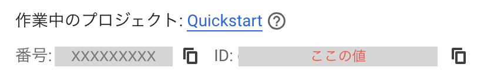

# [Transformer Models and BERT Model](https://github.com/GoogleCloudPlatform/asl-ml-immersion/blob/master/notebooks/text_models/solutions/classify_text_with_bert.ipynb)

## GCPで実行（Nodebook作成）

* CloudShellから実行

  [main.tf](https://github.com/terraform-google-modules/terraform-docs-samples/blob/main/vertex_ai/user_managed_notebooks_instance/main.tf)にprojectを追加し、実行

    

  ```bash
  # Terraformファイル作成
  mkdir terraform; vi terraform/main.tf
  # Terraform初期化
  terraform init
  # 事前確認
  terraform plan
  # 正常に実行できたら反映
  terraform apply
  ```

* main.tf

  ```tf
  # [START aiplatform_create_user_managed_notebooks_instance_sample]
  resource "google_notebooks_instance" "basic_instance" {
    project      = "設定"
    name         = "notebooks-instance-basic"
    location     = "us-central1-a"
    machine_type = "e2-medium"

    vm_image {
      project      = "deeplearning-platform-release"
      image_family = "tf-ent-2-9-cu113-notebooks"
    }
  }
  # [END aiplatform_create_user_managed_notebooks_instance_sample]
  ```

  * GPU利用すると、GCP上でインスタンス立ち上げられず。
    無料枠だと無理なのか。

## Local実行

* Packageのinstall
  * conda activate

    ```bash
    conda activate ./env
    ```

  * [Tensorflow-hub]([Tensorflow-hub](https://anaconda.org/conda-forge/tensorflow-hub)) install

    ```bash
    conda install conda-forge::tensorflow-hub
    ```

  * [tensorflow-text](https://github.com/sun1638650145/Libraries-and-Extensions-for-TensorFlow-for-Apple-Silicon/releases/tag/v2.13) install

    candaにも、標準pipでも提供されていない。
    ソースからビルドしたwheelを取り込む
    バージョンは`tensorflow-macos`のバージョンに合わせる

    ```bash
    # 3.8系
    # python -m pip install https://github.com/sun1638650145/Libraries-and-Extensions-for-TensorFlow-for-Apple-Silicon/releases/download/v2.13/tensorflow_text-2.13.0-cp38-cp38-macosx_11_0_arm64.whl
    # 3.9系（cp39）
    python -m pip install https://github.com/sun1638650145/Libraries-and-Extensions-for-TensorFlow-for-Apple-Silicon/releases/download/v2.18/tensorflow_text-2.18.0-cp39-cp39-macosx_11_0_arm64.whl
    ```

    * Tensorflow系パッケージバージョン確認

      ```bash
      python -m pip list | grep tensorflow
      ```

      ```text
      tensorflow                2.11.0
      tensorflow-estimator      2.13.0
      tensorflow-hub            0.12.0
      tensorflow-macos          2.13.0
      tensorflow-metal          1.0.1
      tensorflow-text           2.13.0
      ```

    * 実行時に`symbol not found`エラーが発生することがある。
      その場合、tensorflow-macos,tensorflow-metalをinstallしなおし。

      ```text
      File "/Users/...../generative-ai-for-developers-learning-path/env/lib/python3.8/site-packages/tensorflow/python/framework/load_library.py", line 151, in load_library
      py_tf.TF_LoadLibrary(lib)
      tensorflow.python.framework.errors_impl.NotFoundError: dlopen(/Users/...../generative-ai-for-developers-learning-path/env/lib/python3.8/site-packages/tensorflow-plugins/libmetal_plugin.dylib, 0x0006): symbol not found in flat namespace '_TF_GetInputPropertiesList' 
      ```

      ```bash
      # uninstall & install
      python -m pip uninstall tensorflow-macos tensorflow-metal
      python -m pip install tensorflow-macos tensorflow-metal
      # まだ解決しないなら
      python -m pip cache purge
      python -m pip install --no-cache-dir tensorflow-macos tensorflow-metal
      ```

    * 実行時にprotobufのバージョンエラー
      その場合は、protobufをダウングレード

      ```text
      TypeError: Descriptors cannot be created directly.
      If this call came from a _pb2.py file, your generated code is out of date and must be regenerated with protoc >= 3.19.0.
      If you cannot immediately regenerate your protos, some other possible workarounds are:
      1. Downgrade the protobuf package to 3.20.x or lower.
      2. Set PROTOCOL_BUFFERS_PYTHON_IMPLEMENTATION=python (but this will use pure-Python parsing and will be much slower).

      More information: https://developers.google.com/protocol-buffers/docs/news/2022-05-06#python-updates
      ```

      * バージョン確認

        ```bash
        python -m pip list | grep protobuf
        ```

        ```text
        protobuf                  4.25.5
        ```

      * ダウングレード

        ```bash
        python -m pip install -U protobuf~=3.20.0
        ```

        ```text
        protobuf                  3.20.3
        ```

  * google-cloud-aiplatformをinstall

    ```bash
    python -m pip install google-cloud-aiplatform
    ```

    * sslでエラーがでることがある

      ```bash
      export CRYPTOGRAPHY_OPENSSL_NO_LEGACY=1
      ```

    * pythonのバージョンを上げた際に、この設定が入っていることでデータダウンロードが出来なくなる。バージョンを上げる際には削除

      ```bash
      unset CRYPTOGRAPHY_OPENSSL_NO_LEGACY
      ```

  * tf-models-officialをinstall

    ```bash
    python -m pip install tf-models-official
    ```

* その他実装
  * 証明書エラーが発生するので暫定対応として無効にする
    `Exception: URL fetch failure on https://ai.stanford.edu/~amaas/data/sentiment/aclImdb_v1.tar.gz: None -- [SSL: CERTIFICATE_VERIFY_FAILED] certificate verify failed: self-signed certificate in certificate chain (_ssl.c:1131)`

    ```python
    # データダウロードする前に実装
    ssl._create_default_https_context = ssl._create_unverified_context
    ```

    * 証明書を確認すると中間証明書が含まれていない模様

      ```bash
      openssl s_client -connect ai.stanford.edu:443 -showcerts
      ```

      エントリが１つしかない

      ```text
      Certificate chain
      0 s:C = US, ST = California, O = Stanford University, CN = ai.stanford.edu
        i:C = US, O = Internet2, CN = InCommon RSA Server CA 2
        a:PKEY: rsaEncryption, 2048 (bit); sigalg: RSA-SHA384
        v:NotBefore: Oct  8 00:00:00 2024 GMT; NotAfter: Oct  8 23:59:59 2025 GMT
      ```

  * Tensorflowのバージョンを2.18まで上げると。。。
    Tensorflow2.16からKeras3が利用される。
    * [saved_modelをload_modelで読み込めなくなった](https://qiita.com/n_kats_/items/80725804ed7d3c61a691)
    * 再度モデルから作成しなおし
